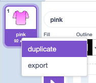
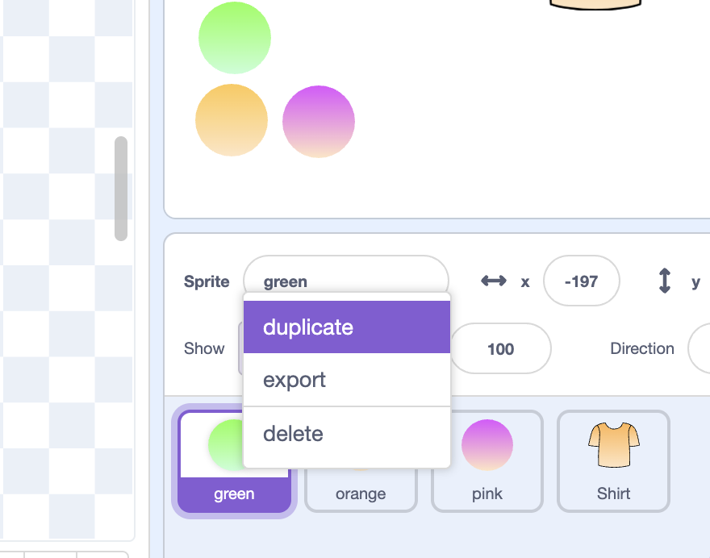
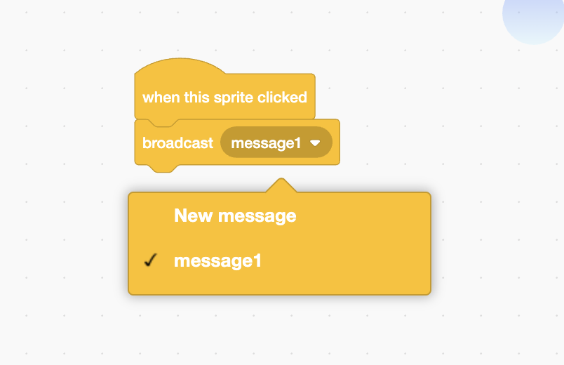
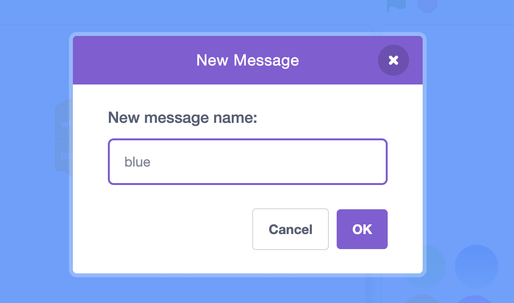

## Creating your kit

In this step you'll design the basics of the kit, and can add a background too.

--- task ---
Delete the cat sprite and create a sports kit, you could choose a sprite, or draw with the paint tool.


We searched for "shirt".


--- /task ---


--- task ---
Change the design to how you want it, and add your first colour with the fill tool. We used the gradient fill to make the costume colours pop!


--- /task ---

--- task ---
Right click to duplicate the costume for each colour you want to use. 


--- /task ---

--- task ---
Fill each costume with a new colour and name the costumes to match.


--- /task ---

--- task ---
Create colour picker sprites. These could be squares, circles, or draw them freehand with the paint tool. 

Duplicate a sprite for each colour and name them after the colour.



--- /task ---


--- task ---

When sprite is clicked add a broadcast message to each of the colour sprites. 

Name the new message after the colour. 

```blocks3
when this sprite clicked
broadcast [blue]
``` 





--- /task ---


--- task ---
Add a receive to the kit sprite for each colour you have

```blocks3
when I receive [blue]
switch costume to [blue]
```
--- /task ---

--- task ---
We've used flags to decorate the kit. 

Create a flag sprite then duplicate and fill flag costumes in each colour. You might want to make the colours a bit different from the kit so that they stand out.
--- /task ---

