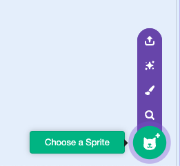
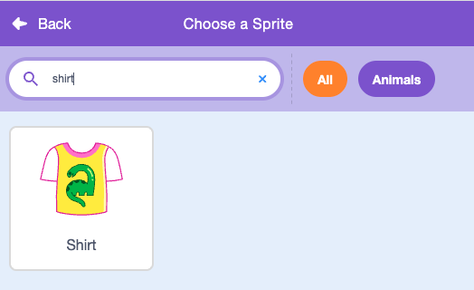
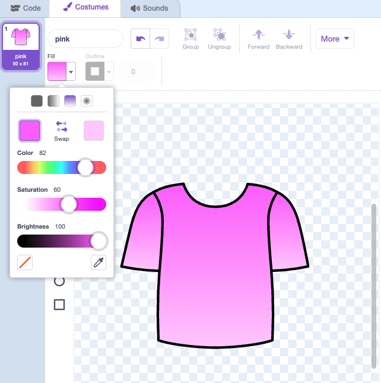

## Creating your kit

In this step you'll design the basics of the kit, and can add a background too.

--- task ---
Delete the cat sprite and create a sports kit, you could draw with the paint tool, or look up a sprite.





We used a shirt and shorts sprite, using the gradient fill to make the costume colours pop!



--- /task ---


--- task ---
Duplicate the costume and change the colour with the fill tool. 

Name the costumes after the colour
--- /task ---


--- task ---
Create colour picker sprites for each costume - these could be squares, circles, or draw them freehand with the paint tool like we did. 

Name the sprites after the colour
--- /task ---


--- task ---

Add a broadcast message to each of the colour sprites. 

```blocks3
when this sprite clicked
broadcast [pink]
``` 

--- /task ---


--- task ---
Add a receive block to kit sprite for each colour option you have

```blocks3
when I receive [pink]
switch costume to [pink]
```
--- /task ---

--- task ---
We've used flags to decorate the kit. 

Create a flag sprite then duplicate and fill flag costumes in each colour. You might want to make the colours a bit different from the kit so that they stand out.
--- /task ---

