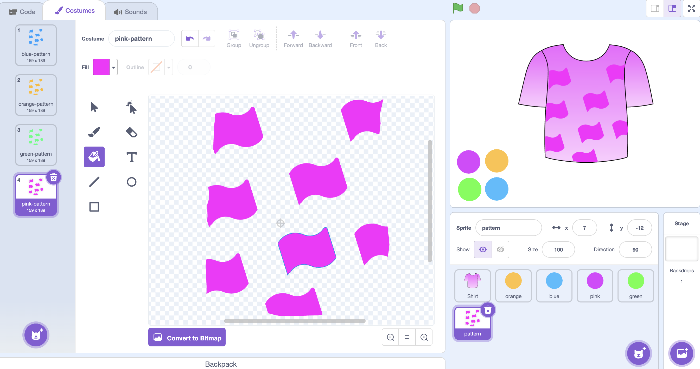
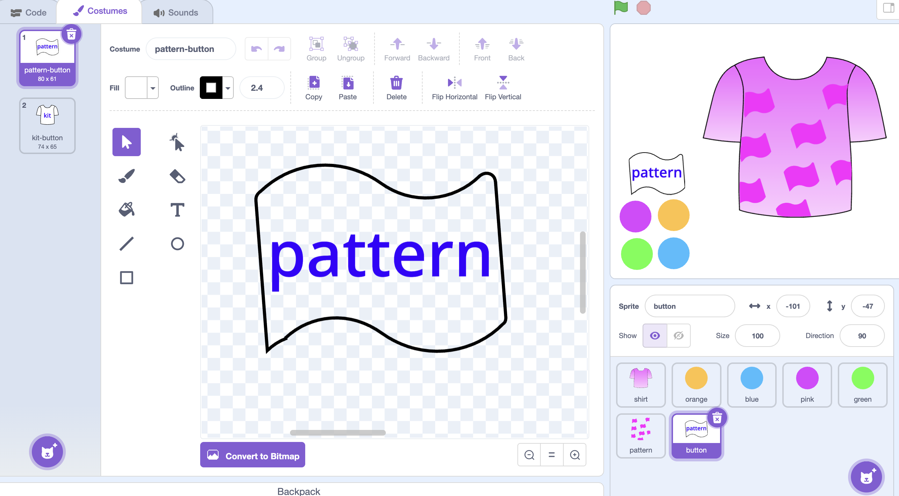
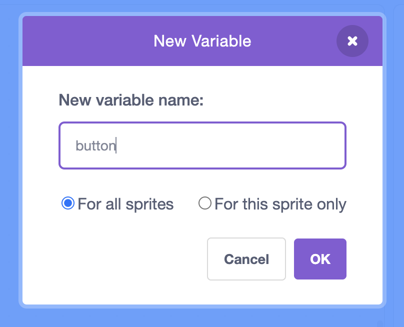
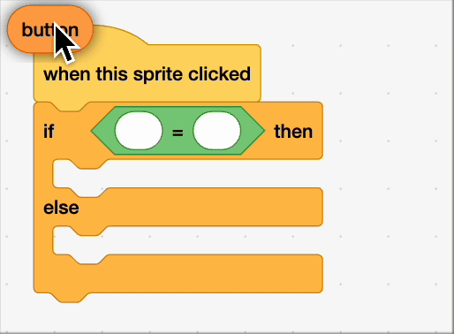

## Adding decoration

--- task ---
Create a pattern sprite to decorate your kit.

Duplicate your pattern costume and fill in each colour. You might want to make the colours a bit different from the kit so that they stand out.



--- /task ---

--- task ---
We'll use a button to switch between colouring the kit and pattern. 

Make two costumes for the button, one for when you are choosing the kit colours, another for when you are choosing flag colours. We've created a t-shirt and a flag, but you could also use a circle shape. The main thing is to make them different. 



--- /task ---


--- task ---

To toggle between the buttons, make a new `variable`{:class="block3variables"} and name it button.



--- /task ---


--- task ---

Use the green `flag`{:class="block3events"} block and `set`{:class="block3variables"} the button to pattern 

```blocks3
when flag clicked
set [button v] to [pattern]
```
--- /task ---


--- task ---
The button will change when we click on it. Use a `when sprite clicked`{:class="block3events"} block to start with.

Add an `if else`{:class="block3control"} block, this can be used to change what button `variable`{:class="block3variables"} is stored. Drop an `operator`{:class="block3operators"} into this.

`If`{:class="block3control"} the button is set to kit, then we change it to pattern. Otherwise (`else`{:class="block3control"}) we keep it set as kit.



Here is what the whole block looks like

```blocks3
when this sprite clicked
if <(button) = (kit)> then
set [button v] to (pattern)
else
set [button v] to (kit)
```

---/task ---


--- task ---

Now we can change between cosutmes using the button `variable`{:class="block3variables"}.

If the button is set to pattern then change costume to pattern, else change costume to kit.

Put this inside forever block, otherwise it will only switch once. 

```blocks3
when flag clicked
set [button] to [kit] // reset to kit
forever
if <[button] = [kit]> then
switch costume to [kit-button]
if <[button]=[pattern]> then
switch costume to [pattern-button]
```

--- /task ---


Test to see if it has worked by cliking on the green flag. Now when you click the button in the scene it should toggle between the two costumes 
