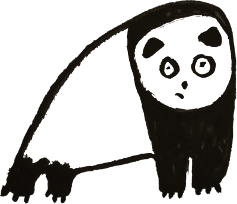

## Making a selector button

--- task ---

Make a button sprite. 

It'll need to have two costumes, one for when you are choosing the kit colours, another for when you are choosing flag colours. We've created a t-shirt and a flag, but you could also use a regular button. 

--- /task ---


--- task ---

We neeed to toggle the button between the kit or flag. To do this we can use a variable that stores the words "kit" or "flag". 

Make a variable and name it button. If you like you can add a blue tick to help you see what is being stored. 

--- /task ---


--- task ---

We can start with storing the word "kit" by setting button variable to "kit" when green flag is clicked 

```blocks3
when flag clicked
set [button v] to [kit]
``` 

--- /task ---


--- task ---

Let's use an operator to check what is being stored in the button variable. If the button is storing "kit" we'll change is to "flag". Otherwsie, we set it to "kit".



```blocks3
when this sprite clicked
if <(button) = (kit)> then
set [button v] to (flag)
else
set [button v] to (kit)
```

--- /task ---


--- task ---

We can swtich between the kit and flag costumes depending on if the button is kit or flag. Put this inside forever block, otherwise it will only switch once. 

```blocks3
when flag clicked
set [button] to [kit] // reset to kit
forever
if <[button] = [kit]> then
switch costume to [kit-button]
if <[button]=[flag]> then
switch costume to [flag-button]
```

--- /task ---
