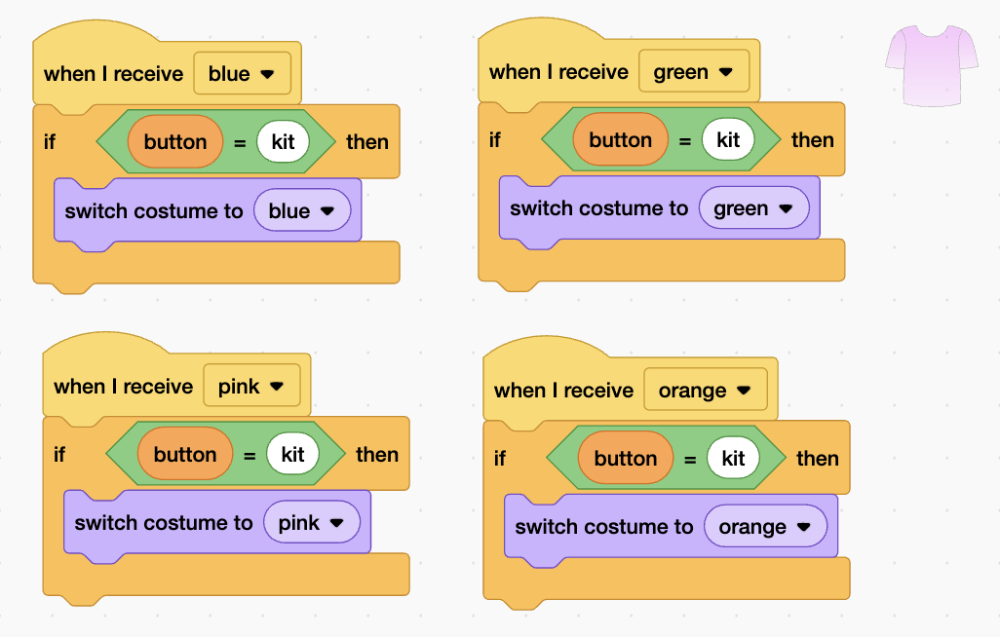

## Choosing all the colours!

In this step you can change the kit or pattern colours for a fully customised kit!

--- task ---
In the kit sprite add an `if`{:class="block3control"} block to the block you made earlier. This can swtich cosutmes only if the button is set as kit.

```blocks3
when I receive [blue v]
if <(button) = [kit]> then
 switch costume to [blue v]
```
Do this for each of the colours and test to make sure it works. 



--- /task ---

--- task ---
In the pattern sprite add the `receive`{:class="block3events"} block for each colour. 

Add an `if`{:class="block3control"} block to this, and `switch costume`{:class="block3looks"} if the button is set as pattern. This is very similar to the blocks you made for the kit.

TIP! to save time you can copy and paste the blocks and just change the colour names.

```blocks3
when I receive [pink v]
if <(button) = [pattern]> then
 switch costume to [pink v]
```

--- /task ---


Test it out! You've made a kit chooser! You should be able to change the kit and pattern colours to create a custom design! 

