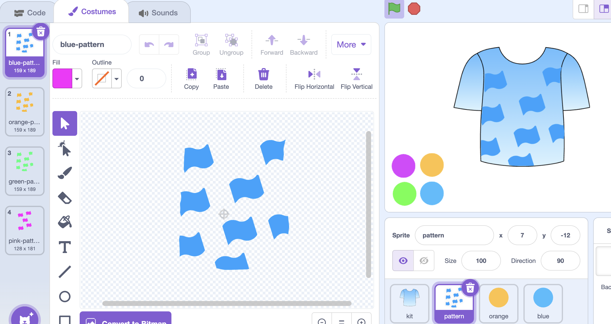

## Decorate with a pattern

Create a pattern sprite to decorate your kit.
--- task ---

Creaete a new sprite and name it pattern.
--- /task ---

--- task ---
Draw a shape.

Resize the shape and move to where you want it on the kit.
--- /task ---

--- task ---
To create the pattern, copy and paste or draw a new shape and move to where you want it. Keep doing this until you have a pattern you like.

--- /task ---

--- task ---
Duplicate your pattern costume and fill in each colour. You might want to make the colours a bit different from the kit so that they stand out.

--- /task ---

